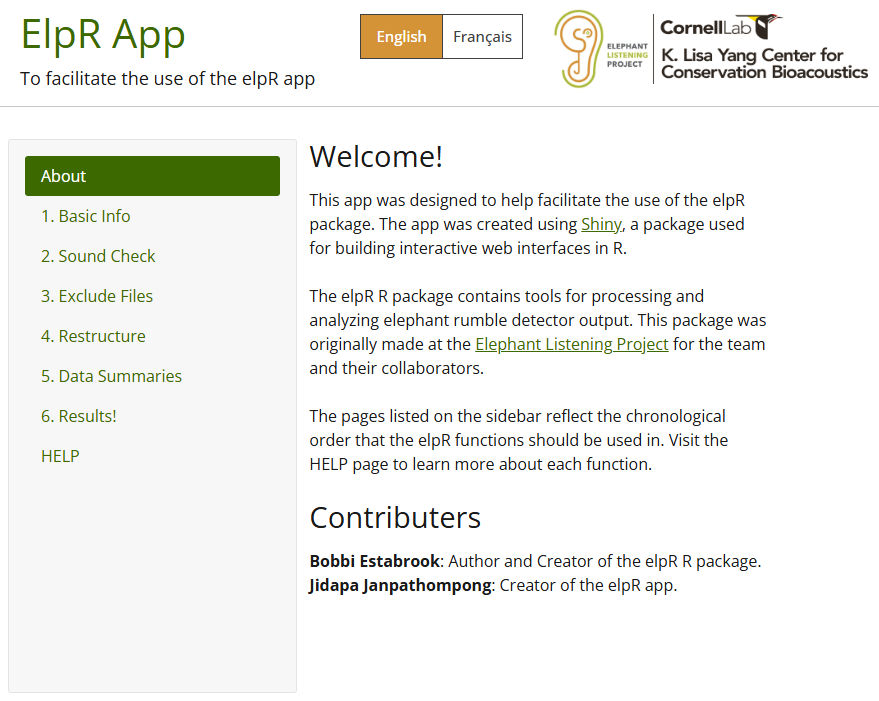
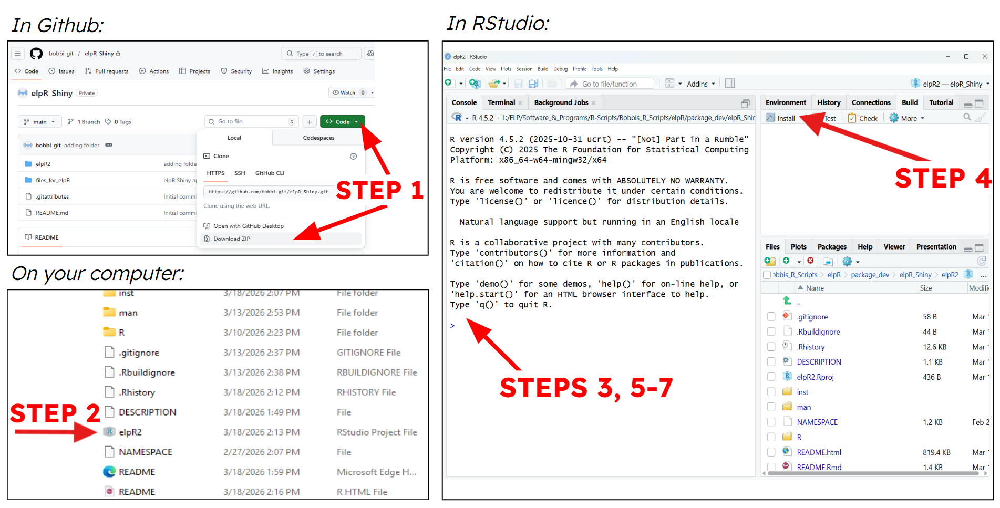

elpR2
================

## Goal

<!-- badges: start -->

<!-- badges: end -->

The goal of the elpR2 package is to provide a user interface containing
tools for processing and analyzing elephant rumble detector output. The
user interface appears like so:

<br> 

## First Time Installation

You can install the development version of elpR2 like so:

1)  Download ZIP from GitHub and extract all contents

2)  Navigate to /elpR2/elpR2.Rproj and open with RStudio

3)  Install devtools and roxygen2 by typing the following command in the
    console:

``` r
install.packages(c("devtools", "roxygen2"))
```

4)  Build elpR2 package by clicking the “Install” button in the “Build”
    tab.

5)  Install elpR2 dependencies by typing the following command in the
    console:

``` r
devtools::install()
```

6)  Load in elpR2 functions by typing the following command in the
    console:

``` r
devtools::load_all()
```

7)  Open shiny app by typing the following command in the console:

``` r
elpRApp()
```

<br> 

## Usage

Follow installation steps 2, 4, 6, and 7 each time you want to run the
app. The elpR2 functions can be run from the app. Output files from the
functions are placed in the “files_for_elpR” folder, unless indicated
otherwise. IMPORTANT: Do not change the folder organization structure!

## Available Functions

``` r
elpRApp()
sound_check_function()
exclude_sounds_function()
restructure_rumble_function()
restructure_gunshot_function()
restructure_general_function()
data_summaries_function()
maps_function()
```

Function documentation for elpR2 can be viewed in the “HELP” tab within
the app.

## Example Datasets

This package provides example datasets to practice using elpR2.
